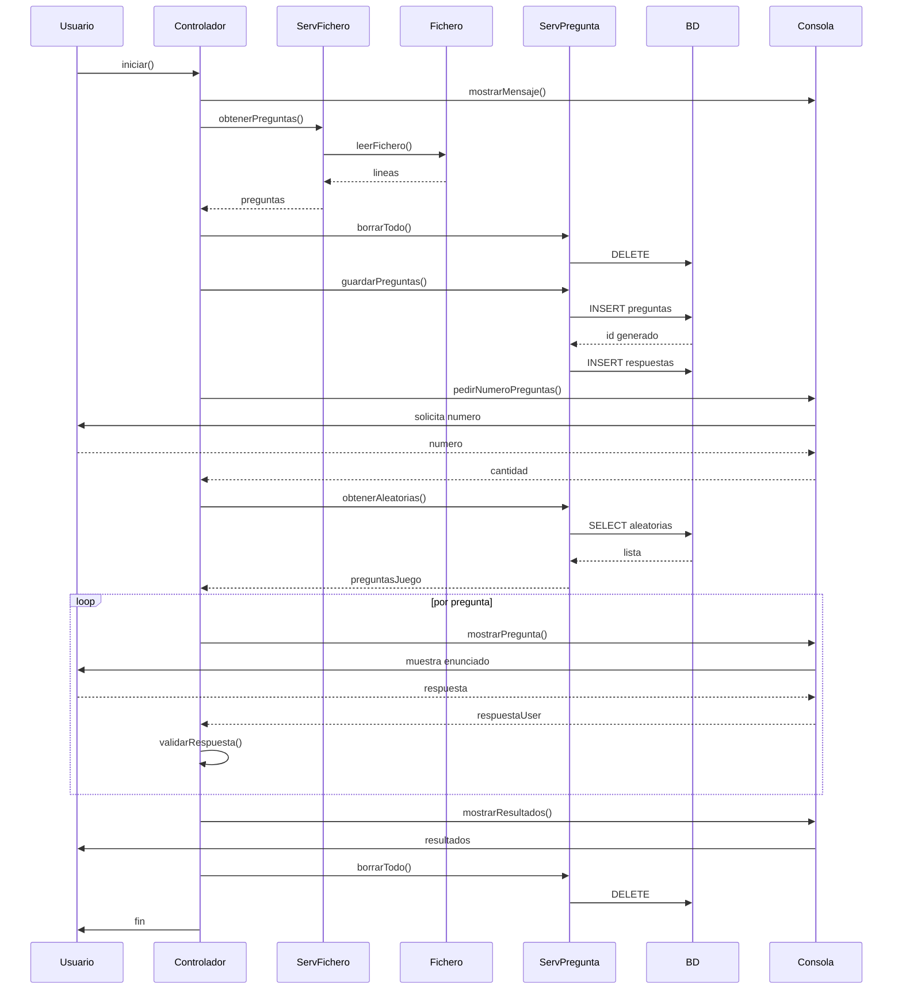
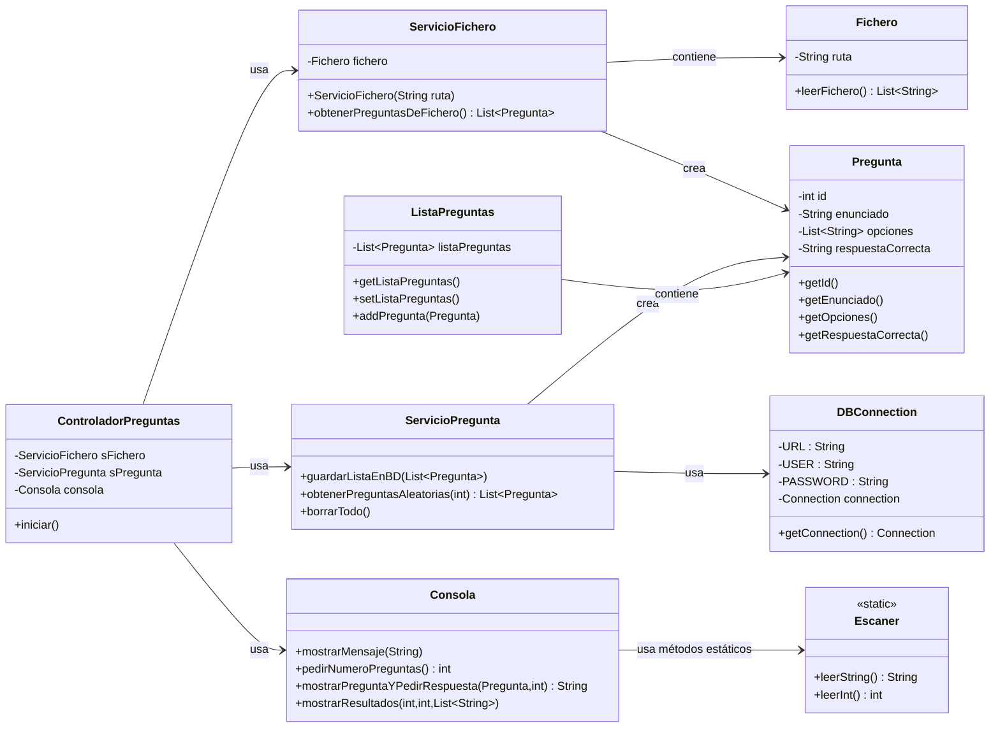

```mermaid
sequenceDiagram

    participant U as Usuario
    participant C as Controlador
    participant SF as ServFichero
    participant F as Fichero
    participant SP as ServPregunta
    participant DB as BD
    participant V as Consola

    U ->> C: iniciar()

    C ->> V: mostrarMensaje()
    C ->> SF: obtenerPreguntas()
    SF ->> F: leerFichero()
    F -->> SF: lineas
    SF -->> C: preguntas

    C ->> SP: borrarTodo()
    SP ->> DB: DELETE

    C ->> SP: guardarPreguntas()
    SP ->> DB: INSERT preguntas
    DB -->> SP: id generado
    SP ->> DB: INSERT respuestas

    C ->> V: pedirNumeroPreguntas()
    V ->> U: solicita numero
    U -->> V: numero
    V -->> C: cantidad

    C ->> SP: obtenerAleatorias()
    SP ->> DB: SELECT aleatorias
    DB -->> SP: lista
    SP -->> C: preguntasJuego

    loop por pregunta
        C ->> V: mostrarPregunta()
        V ->> U: muestra enunciado
        U -->> V: respuesta
        V -->> C: respuestaUser
        C ->> C: validarRespuesta()
    end

    C ->> V: mostrarResultados()
    V ->> U: resultados

    C ->> SP: borrarTodo()
    SP ->> DB: DELETE

    C ->> U: fin

```

----------------------------------------------------------------------------------------------------------------------------------------------------------------------------------

```mermaid
classDiagram
    direction LR

    class Fichero {
        -String ruta
        +leerFichero() List~String~
    }

    class ServicioFichero {
        -Fichero fichero
        +ServicioFichero(String ruta)
        +obtenerPreguntasDeFichero() List~Pregunta~
    }

    class Pregunta {
        -int id
        -String enunciado
        -List~String~ opciones
        -String respuestaCorrecta
        +getId()
        +getEnunciado()
        +getOpciones()
        +getRespuestaCorrecta()
    }

    class ListaPreguntas {
        -List~Pregunta~ listaPreguntas
        +getListaPreguntas()
        +setListaPreguntas()
        +addPregunta(Pregunta)
    }

    class ServicioPregunta {
        +guardarListaEnBD(List~Pregunta~)
        +obtenerPreguntasAleatorias(int) List~Pregunta~
        +borrarTodo()
    }

    class DBConnection {
        -URL : String
        -USER : String
        -PASSWORD : String
        -Connection connection
        +getConnection() Connection
    }

    class Consola {
        +mostrarMensaje(String)
        +pedirNumeroPreguntas() int
        +mostrarPreguntaYPedirRespuesta(Pregunta,int) String
        +mostrarResultados(int,int,List~String~)
    }

    class Escaner {
        <<static>>
        +leerString() String
        +leerInt() int
    }

    class ControladorPreguntas {
        -ServicioFichero sFichero
        -ServicioPregunta sPregunta
        -Consola consola
        +iniciar()
    }

    %% RELACIONES

    ControladorPreguntas --> ServicioFichero : usa
    ControladorPreguntas --> ServicioPregunta : usa
    ControladorPreguntas --> Consola : usa

    ServicioFichero --> Fichero : contiene
    ServicioFichero --> Pregunta : crea

    ServicioPregunta --> DBConnection : usa
    ServicioPregunta --> Pregunta : crea

    ListaPreguntas --> Pregunta : contiene

    Consola --> Escaner : usa métodos estáticos

```
