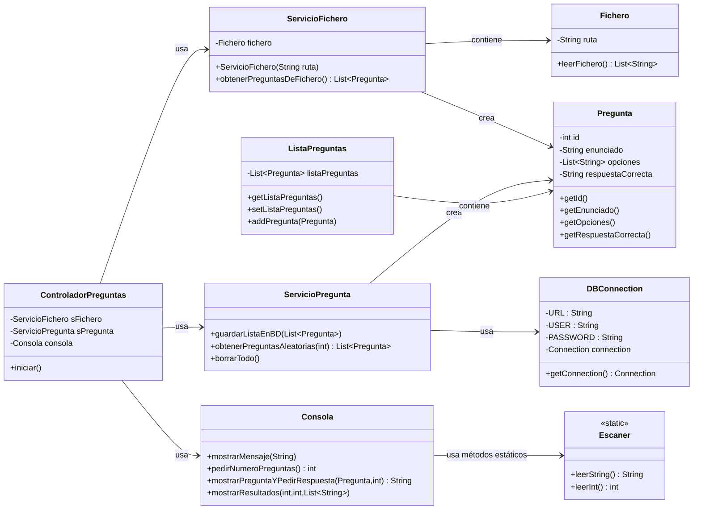

```mermaid
classDiagram
    direction LR

    class Fichero {
        -String ruta
        +leerFichero() List~String~
    }

    class ServicioFichero {
        -Fichero fichero
        +ServicioFichero(String ruta)
        +obtenerPreguntasDeFichero() List~Pregunta~
    }

    class Pregunta {
        -int id
        -String enunciado
        -List~String~ opciones
        -String respuestaCorrecta
        +getId()
        +getEnunciado()
        +getOpciones()
        +getRespuestaCorrecta()
    }

    class ListaPreguntas {
        -List~Pregunta~ listaPreguntas
        +getListaPreguntas()
        +setListaPreguntas()
        +addPregunta(Pregunta)
    }

    class ServicioPregunta {
        +guardarListaEnBD(List~Pregunta~)
        +obtenerPreguntasAleatorias(int) List~Pregunta~
        +borrarTodo()
    }

    class DBConnection {
        -URL : String
        -USER : String
        -PASSWORD : String
        -Connection connection
        +getConnection() Connection
    }

    class Consola {
        +mostrarMensaje(String)
        +pedirNumeroPreguntas() int
        +mostrarPreguntaYPedirRespuesta(Pregunta,int) String
        +mostrarResultados(int,int,List~String~)
    }

    class Escaner {
        <<static>>
        +leerString() String
        +leerInt() int
    }

    class ControladorPreguntas {
        -ServicioFichero sFichero
        -ServicioPregunta sPregunta
        -Consola consola
        +iniciar()
    }

    %% RELACIONES

    ControladorPreguntas --> ServicioFichero : usa
    ControladorPreguntas --> ServicioPregunta : usa
    ControladorPreguntas --> Consola : usa

    ServicioFichero --> Fichero : contiene
    ServicioFichero --> Pregunta : crea

    ServicioPregunta --> DBConnection : usa
    ServicioPregunta --> Pregunta : crea

    ListaPreguntas --> Pregunta : contiene

    Consola --> Escaner : usa métodos estáticos
```

```mermaid
classDiagram
    direction LR

    class Fichero {
        -String ruta
        +leerFichero() List~String~
    }

    class ServicioFichero {
        -Fichero fichero
        +ServicioFichero(String ruta)
        +obtenerPreguntasDeFichero() List~Pregunta~
    }

    class Pregunta {
        -int id
        -String enunciado
        -List~String~ opciones
        -String respuestaCorrecta
        +getId()
        +getEnunciado()
        +getOpciones()
        +getRespuestaCorrecta()
    }

    class ListaPreguntas {
        -List~Pregunta~ listaPreguntas
        +getListaPreguntas()
        +setListaPreguntas()
        +addPregunta(Pregunta)
    }

    class ServicioPregunta {
        +guardarListaEnBD(List~Pregunta~)
        +obtenerPreguntasAleatorias(int) List~Pregunta~
        +borrarTodo()
    }

    class DBConnection {
        -URL : String
        -USER : String
        -PASSWORD : String
        -Connection connection
        +getConnection() Connection
    }

    class Consola {
        +mostrarMensaje(String)
        +pedirNumeroPreguntas() int
        +mostrarPreguntaYPedirRespuesta(Pregunta,int) String
        +mostrarResultados(int,int,List~String~)
    }

    class Escaner {
        <<static>>
        +leerString() String
        +leerInt() int
    }

    class ControladorPreguntas {
        -ServicioFichero sFichero
        -ServicioPregunta sPregunta
        -Consola consola
        +iniciar()
    }

    %% RELACIONES

    ControladorPreguntas --> ServicioFichero : usa
    ControladorPreguntas --> ServicioPregunta : usa
    ControladorPreguntas --> Consola : usa

    ServicioFichero --> Fichero : contiene
    ServicioFichero --> Pregunta : crea

    ServicioPregunta --> DBConnection : usa
    ServicioPregunta --> Pregunta : crea

    ListaPreguntas --> Pregunta : contiene

    Consola --> Escaner : usa métodos estáticos

```
